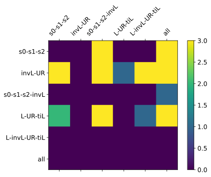
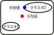

# The Title of Slide:  It Might Be So Long
<!-- _class: title -->

Presenter: stakeval0

## はじめに

- 逆強化学習: 実在の最適行動から強化学習に必要な報酬関数を生成
  - 例: 生活道路での危険予知運転[Shimosaka, 2021]
  - *課題: 多くの実在の最適行動が必要*
- メタ逆強化学習:
  - 各タスクに最小の更新で最適な報酬関数を生成するような初期NNパラメータの獲得
  - **課題: 単一の初期パラメータでは限界**
    <li class=arrow>ドア開けタスクなら開き戸と引き戸をまとめて学習</li>
- タスククラスタリングメタ学習:
  - 類似度でタスククラスタリングし各クラスタに初期パラメータ生成
    <ul><li class=arrow>開き戸と引き戸を分けて学習</li></ul>
  - 課題: 逆強化学習の適用例がなく適切な特徴量が不明

メタ逆強化学習

タスククラスタリング
メタ逆強化学習

研究目的: タスククラスタリングメタ逆強化学習に向けた適切な特徴量の発見

## 従来研究
<!-- _class: section -->

### 逆強化学習: Maximum Entropy Deep Inverse Reinforcement Learning (DeepIRL)

 

- 目的: *強化学習で用いる報酬関数の獲得*
- 必要なデータ: 人間などの最適な実行動
  - エキスパート行動系列とも
- 方法: 現在の報酬関数から得られる状態到達頻度とエキスパートの状態到達頻度を一致させる
- 手順:
  1. 現在のパラメータで各状態に報酬値$R(s)$を計算
  2. 報酬値から強化学習させて方策$\pi(a|s)$を獲得
  3. エージェントに行動させ、エキスパート行動との状態到達頻度の差を得る
  4. 報酬関数の改善すべき勾配を学習パラメータにフィードバック

### メタ学習: Model-Agnostic Meta-Learning (MAML)

- 目的: *少量の更新で学習できる事前学習モデルのNNパラメータ$\theta^\star$の獲得*
- 方法: 各タスクの最適パラメータ$\theta_i^*$と現在のメタ学習パラメータ$\theta$の差$\nabla\mathcal L_i$を最小化
- 大まかな手順: 以下のループ
  1. 各タスクで数エポックだけファインチューンしたパラメータ$\theta_i'$を計算
  2. $\theta_i'$から計算される勾配の和$\sum_{\mathcal T_i\sim p(\mathcal T)}\nabla\mathcal L_{\mathcal T_i}(\theta_i')$でパラメータ更新

出典: [Finn+, 2017]

最適な$\theta^\star$から**数回の学習でそれぞれのタスクに適応可能**

### タスククラスタリングメタ学習

 

- 目的: MAMLにおけるタスク異質性の排除
  - 開き戸と引き戸をまとめて学習するのが正しいのか
- 方法:
  - データセットベース特徴量: データセット(画像や文書)でクラスタリング
  - ファインチューンベース特徴量: ファインチューンによる勾配などでクラスタリング
- 手順 (Task Similarity Aware MAML[Zhou+, 2021]): 
  1. MAMLを実行
  2. クラスタリング特徴量を生成
  3. クラスタリング
  4. クラスタごとの共通パラメータ学習 (MAML)

メタ逆強化学習

タスククラスタリング
メタ逆強化学習

### 従来研究のタスククラスタリング特徴量

<!--

タスククラスタリングメタ学習に向けた特徴量は大まかにデータセットベースとファインチューンベースに分類できます。
データセットベースでは行動系列のような学習前に得られるデータで分類する一方、ファインチューンベースではMAML

-->

 

モデルパラメータの情報を反映可能なファインチューンベース特徴量に着目する

#### 勾配[Garcia+, 2021]

- $\nabla_\theta\mathcal L_i$: 各タスク$\mathcal T_i$の損失関数のニューラルネットパラメータ$\theta$への勾配
  - NNパラメータの更新ベクトル

#### ファインチューンパラメータ [Zhou+, 2021]

- $\theta_i$: MAMLで学習した共通パラメータ$\theta$から各タスク$\mathcal T_i$にファインチューンさせたパラメータ

 

## 提案特徴量

#### 損失関数の報酬出力値$r$への勾配: $\nabla_r\mathcal L_i$

- 意味: 報酬関数の類似はタスクの類似
- 意図: 報酬関数の更新ベクトルで分類

#### 損失関数の勾配 × 学習幅: $\frac{\mathcal L_i}{\|\nabla\mathcal L_i\|}\nabla\mathcal L_i\quad\left(\frac{\mathcal L_i}{\|\nabla_\theta\mathcal L_i\|}\nabla_\theta\mathcal L_i,\,\frac{\mathcal L_i}{\|\nabla_r\mathcal L_i\|}\nabla_r\mathcal L_i\right)$

- 意味: 損失関数の勾配のノルムを損失関数値に変えたもの
- 意図: 勾配に信頼できる学習幅を与える

#### タスクごとのパラメータ $-$ 共通パラメータ: $\theta_i-\theta$

- 意味: MAMLの学習後、各タスク$\mathcal T_i$にファインチューンさせたパラメータ$\theta_i$から共通パラメータ$\theta$を引いたもの
- 意図: $\theta_i$のコサイン類似度の中心を原点$\mathrm O$から$\theta$にする

## 従来研究の特徴量と提案特徴量

||パラメータ空間|報酬関数空間|
|-|-|-|
|勾配のみ|$\nabla_\theta\mathcal L_i$(従来)|$\nabla_r\mathcal L_i$|
|勾配 + 学習幅|$\displaystyle\frac{\mathcal L_i}{\\|\nabla_\theta\mathcal L_i\\|}\nabla_\theta\mathcal L_i$|$\displaystyle\frac{\mathcal L_i}{\\|\nabla_r\mathcal L_i\\|}\nabla_r\mathcal L_i$|
|生値|$\theta_i$(従来), $\theta_i-\theta$||

## 提案手法の全体の流れ

## 実験項目

- 実験1: 特定クラスタでの特徴量の比較
  - 期待されるクラスタが検出されるか
- 実験2: 損失関数値による特徴量の比較
  - Few-shot学習をさせたときどれだけ損失関数が下がっているか

## 実験1: 特定クラスタでの特徴量の比較
<!-- _class: section -->

### 実験内容

 

- 目的: タスククラスタリングメタ逆強化学習に最適な 特徴量の発見
- 比較する特徴量: $\nabla_\theta\mathcal L_i,\hspace{0.5em}\nabla_r\mathcal L_i,\hspace{0.5em}\frac{\mathcal L_i}{\|\nabla_\theta\mathcal L_i\|}\nabla_\theta\mathcal L_i,\hspace{0.5em}\frac{\mathcal L_i}{\|\nabla_r\mathcal L_i\|}\nabla_r\mathcal L_i,\hspace{0.5em}\theta_i,\hspace{0.5em}\theta_i-\theta$
  - $\theta_i$のファインチューンステップ数: 10
- クラスタリング手法: 群平均法
  - コサイン距離
  - ユークリッド距離
- タスク: 右図のような迷路問題
  - 「s0 ,s1, s2」と「invL, UR」がクラスタ
- エキスパート行動系列:
  - 動的計画法で計算
  - 各タスクに100個ずつ

  
simple0 (s0)

  
simple1 (s1)

  
simple2 (s2)

  
L (L)

  
inverse L (invL)

  
U right (UR)

  
trans inverse L (tiL)

スタート地点: 障害物以外
ゴール: 緑, 障害物: 赤

### 全体の中での評価箇所

本実験では階層クラスタリングまで行い、得られたデンドログラムに着目する

### クラスタリング結果

クラスタリングすると、タスク構造を表すデンドログラムが得られる

- 評価指標: 「s0 ,s1, s2」と「invL, UR」の2組をまとめた部分木が存在するか
  - 20シード試して部分木の存在する割合を見る

| 手法 | $\nabla_\theta\mathcal L_i$ | $\frac{\mathcal L_i}{\\|\nabla_\theta\mathcal L_i\\|}\nabla_\theta\mathcal L_i$ | $\nabla_r\mathcal L_i$ | $\frac{\mathcal L_i}{\\|\nabla_r\mathcal L_i\\|}\nabla_r\mathcal L_i$ | $\theta_i$ | $\theta_i-\theta$ |
| ---- | ---- | ---- | ---- | ---- | ---- | ---- |
| cos |  |  |  |  |  |  |
| euc |  |  |  |  |  |  |

### 考察: 最も良い特徴量

 

- 「s0, s1, s2」: 
  - まとめた割合の大きい特徴量: $\nabla_\theta\mathcal L_i,\hspace{0.5em}\theta_i,\hspace{0.5em}\theta_i-\theta$
  - 要因: パラメータ構造の情報を得られたため
- 「invL, UR」: 
  - まとめた割合の大きい特徴量: $\frac{\mathcal L_i}{\|\nabla_r\mathcal L_i\|}\nabla_r\mathcal L_i$
  - 要因: 迷路の障害物の一致割合が大きいことを反映したため
- 結論:
  - $\theta_i,\theta_i-\theta$: 計算時間が他のステップ数倍だが良い特徴量
  - $\nabla_\theta\mathcal L_i$: 誤差はあるが明らかな類似性を高速計算
  - $\nabla_r\mathcal L_i,\hspace{0.5em}\frac{\mathcal L_i}{\|\nabla_r\mathcal L_i\|}\nabla_r\mathcal L_i$: 報酬関数の形状に敏感

「s0, s1, s2」をまとめた割合

「invL, UR」をまとめた割合

### 考察: 報酬関数への勾配の効果; $\nabla_r\mathcal L_i$

- 期待: $\nabla_\theta\mathcal L_i$と同等の動作
  - $\nabla_r\mathcal L_i$: 報酬関数空間での勾配
  - $\nabla_\theta\mathcal L_i$: パラメータ空間での勾配
- 結果: 「invL, UR」をまとめやすく、障害物座標の一致度合を多く反映
- 考察: $\nabla_\theta\mathcal L_i$のようなパラメータ情報の反映はできない

「s0, s1, s2」をまとめた割合

「invL, UR」をまとめた割合

  
simple0 (s0)

  
simple1 (s1)

  
simple2 (s2)

  
L (L)

  
inverse L (invL)

  
U right (UR)

  
trans inverse L (tiL)

緑がゴール、赤が障害物
スタート地点は障害物以外で一様無作為

### 考察: 勾配 + 学習幅の効果; $\frac{\mathcal L_i}{\|\nabla\mathcal L_i\|}\nabla\mathcal L_i$

 

- 期待: $\nabla\mathcal L_i$のノルムに信頼性をもたせる
- 結果: 「invL, UR」をまとめやすく「s0, s1, s2」をまとめづらい
- 考察: IRLの損失関数はパラメータ空間などでの距離を意味せず、意図通りにならない
  - 使用した損失関数の定義:
  $\displaystyle \mathcal L_\text{Meta-IRL}(\theta, \mathcal D_i)\coloneqq\frac{1}{|\mathcal S|}\sum_{s\in\mathcal S,a\in\mathcal A}\mu_\mathcal D^a\odot\log\left( \frac{\mu_\mathcal D^a}{\pi} \right)$
    - IRLで生成した報酬関数から学習した方策$\pi(a|s)$に対するエキスパートの行動確率$\mu_\mathcal D^a (a|s)$のKLダイバージェンス
    - *パラメータなどの距離ではなく*、報酬関数から導かれた*方策の差異*
    <!-- - 大きな意味を持たない共通パラメータ$\theta$から導かれる報酬関数値$r$に大きく依存 -->
  - ノルムとして本来設定すべきものは学習中に求められないため、特徴量$\frac{\mathcal L_i}{\|\nabla\mathcal L_i\|}\nabla\mathcal L_i$の意図は達成不可能
    - $\nabla_\theta\mathcal L_i$: 最適パラメータからの差異
    - $\nabla_r\mathcal L_i$: 最適報酬値からの差異

「s0, s1, s2」をまとめた割合

「invL, UR」をまとめた割合

### 考察: ファインチューンパラメータベクトルの効果; $\theta_i-\theta$

 

- 期待: $\theta_i$に対してコサイン類似度を使用可能にする
- 結果: $\theta_i$でも十分コサイン類似度を使える
- 考察: 次元数増加で$(\theta_i-\theta)\perp\theta$となりやすいため
  - 216,065次元なら殆ど100%で89.5°から90.5°
  - 全結合層4層で216,065次元なので、多くのDNNでもこの現象は成り立つ
    <li class=arrow>特徴量生成は無作為ではないので必ずしも直交するわけではないが、直交しやすい</li>

$\theta_i$の概念図

$\theta_i-\theta$の概念図

「s0, s1, s2」をまとめた割合

「invL, UR」をまとめた割合

216,065次元での確率密度関数

## 追加実験: 実験1の設定確認
<!-- _class: section -->

### 実験内容

- 目的: 「s0, s1, s2」と「invL, UR」は本当に良いクラスタか
- 内容: 上の2つ以外に実験1でよく見られたクラスタの共通パラメータからFew-shot学習させて損失関数の平均減少幅を見る
  - 「s0, s1, s2, invL」: $\nabla_\theta\mathcal L_i$(コサイン), $\frac{\mathcal L_i}{\|\nabla_\theta\mathcal L_i\|}\nabla_\theta\mathcal L_i$(コサイン)
  - 「L, UR, tiL」: $\nabla_\theta\mathcal L_i$(コサイン), $\frac{\mathcal L_i}{\|\nabla_\theta\mathcal L_i\|}\nabla_\theta\mathcal L_i$(コサイン)
  - 「L, invL, UR, tiL」: $\theta_i$(両方), $\theta_i-\theta$(両方)

- 手順: 
  1. 対象のタスク集合に対して共通パラメータを作成
     - 「s0, s1, s2」, 「invL, UR」, 「s0, s1, s2, invL」, 「L, UR, tiL」, 「L, invL, UR, tiL」, 「全タスク」の6つ
  2. 属する各タスクに対して各クラスタの共通パラメータから数ステップだけFew-shot学習

### 全体の中での評価箇所と評価指標

 

本実験では手順を最後まで行い、Few-shot後の損失関数値に着目する
評価は20シード平均で行う

### 結果と考察1: 実験1でよく見られたクラスタの評価

 

- ウィルコクソンの順位和検定
  - 対立仮説: 縦軸のクラスタ < 横軸のクラスタ
  - 1で$p<0.05$、2で$p<0.01$、3で$p<0.001$
- 読み取れることと考察
  - 「s0, s1, s2」と「invL, UR」は独立した部分集合としては良い結果を残している
    - 実験1の設定の正当性
  - 「s0, s1, s2」よりも「L, UR, tiL」の方が良い
    - $\nabla_\theta\mathcal L_i,\hspace{0.5em}\frac{\mathcal L_i}{\|\nabla_\theta\mathcal L_i\|}\nabla_\theta\mathcal L_i,\hspace{0.5em}\theta_i-\theta$のデンドログラムと一致

エラーバーは標準誤差

## 実験2: 損失関数値による特徴量の比較
<!-- _class: section -->

### 実験内容

<!-- - 実験目的: 実際に各クラスタの共通パラメータからFew-shotファインチューンをさせて評価 -->
- 目的: 最も損失関数値を低下させる特徴量の発見
- 内容: クラスタ数を2に限定してクラスタの共通パラメータからFew-shot学習させて損失関数の平均減少幅を見る
- 手順: 追加実験と同じ
  <!-- 1. 対象のタスク集合に対して共通パラメータを作成
     - 各特徴量で得たデンドログラムを一番上で切った時に得られる各2つのクラスタ
  1. 属する各タスクに対して各クラスタの共通パラメータから数ステップだけFew-shot学習 -->

| 手法 | $\nabla_\theta\mathcal L_i$ | $\frac{\mathcal L_i}{\\|\nabla_\theta\mathcal L_i\\|}\nabla_\theta\mathcal L_i$ | $\nabla_r\mathcal L_i$ | $\frac{\mathcal L_i}{\\|\nabla_r\mathcal L_i\\|}\nabla_r\mathcal L_i$ | $\theta_i$ | $\theta_i-\theta$ |
| ---- | ---- | ---- | ---- | ---- | ---- | ---- |
| cos |  |  |  |  |  |  |
| euc |  |  |  |  |  |  |

### 結果と考察: 各クラスタの共通パラメータからFew-shot学習させたときの損失関数値

 

- 結果: 平均値は$\frac{\mathcal L_i}{\|\nabla_r\mathcal L_i\|}\nabla_r\mathcal L_i$ (dr_sug)が最良
- 理由: 「invL, UR」の損失関数値の減少幅が大きいため
  - 仮説: クラスタ数を$x$とすると損失関数値は$\sqrt x$のように減少
    - $\frac{\mathcal L_i}{\|\nabla_r\mathcal L_i\|}\nabla_r\mathcal L_i$では「invL, UR」とその他の2つに分割
    - 少数タスクの損失関数値を下げる方が平均値の減少に有利
    - 実際、中央値では$\theta_i$を用いたものが有利だった

$\frac{\mathcal L_i}{\|\nabla_r\mathcal L_i\|}\nabla_r\mathcal L_i$の場合

$\theta_i, \theta_i-\theta$の場合

損失関数の平均値

損失関数の中央値

## まとめ

- 目的: *タスククラスタリングメタ逆強化学習に向けた適切な特徴量の発見*
- 提案した特徴量: $\nabla_r\mathcal L_i,\hspace{0.5em}\frac{\mathcal L_i}{\|\nabla_\theta\mathcal L_i\|}\nabla_\theta\mathcal L_i,\hspace{0.5em}\frac{\mathcal L_i}{\|\nabla_r\mathcal L_i\|}\nabla_r\mathcal L_i,\hspace{0.5em}\theta_i-\theta$
- 期待通りのクラスタリング結果を示したもの:
  - タスク数が少なく、精度を重視: $\theta_i,\theta_i-\theta$
  - タスク数が多く、速度を重視: $\nabla_\theta\mathcal L_i$
  - 報酬関数の差異を重視: $\nabla_r\mathcal L_i,\hspace{0.5em}\frac{\mathcal L_i}{\|\nabla_r\mathcal L_i\|}\nabla_r\mathcal L_i$
- 損失関数値を最も下げたもの: $\frac{\mathcal L_i}{\|\nabla_r\mathcal L_i\|}\nabla_r\mathcal L_i$
- 今後の課題:
  - 損失関数値の結果はクラスタ数を2に限定したもの
  - 特徴量の組み合わせ

## 付録
<!-- _class: section -->

### MAMLの詳細

 

最適化ベースのメタ学習の1つ

- 目的: 初期パラメータ調整での未知タスク高速学習
- 手順:
  1. inner-loop: 現パラメータ$\theta$から各タスクに数ステップだけファインチューンしたパラメータ$\theta_i'$の計算
  2. outer-loop: $\theta_i'$からメタ学習パラメータ$\theta$の更新ベクトルを計算
- 定式化: $\displaystyle\theta^\star=\underbrace{\argmin_{\theta} \mathcal L}_\text{outer loop}(\underbrace{\argmin_{\theta_i} \mathcal L(\theta_i,\mathcal D_{\mathcal T_i}^{\mathrm{train}})}_\text{inner loop},\mathcal D_{\mathcal T_i}^{\mathrm{test}})$
- MAMLでのinner-loopとouter-loop
  - inner-loop: $\theta_i'=\theta-\alpha \nabla_\theta  \mathcal L_i(  f_\theta, \mathcal D_i^{\rm{train}} )$
  - outer-loop: $\theta \leftarrow \theta - \beta \nabla_\theta \sum_{\mathcal T_i \sim p(\mathcal T)}  \mathcal L_i ( f_{\theta_i'}, \mathcal D_i^{\rm{test}})$

### 実験1: 高次源におけるコサイン類似度

ベクトル$\bm v_1,\bm v_2\in\mathbb R^d$が一様無作為に抽出されるとき、それらの成す角$\phi=\arg(\bm v_1,\bm v_2)\in[0,\pi]$の従う確率密度関数は以下に比例
$$
  \sin^{d-2}(\phi)
$$

$f(x)=\sin^{216,065-2}(x)$

### 実験1: $\theta_i, \theta_i-\theta$の結果がユークリッド距離とコサイン距離で変わらない理由

$\theta_i, \theta_i-\theta$のデンドログラムは、ユークリッド距離とコサイン距離で大きく変わらなかった

- 原因: $\|\theta_i\|,\ \|\theta_i-\theta\|$が全てのタスクで概ね同じだったため
  - ノルムが同じ2つのベクトル$\bm v_1, \bm v_2\,(r\coloneqq\|\bm v_1\|=\|\bm v_2\|)$があるとき、
    ユークリッド距離の2乗はコサイン距離の定数倍に等しい
    $$
    \begin{aligned}
    \|\bm v_1-\bm v_2\|^2=&\|\bm v_1\|^2+\|\bm v_2\|^2-2\|\bm v_1\|\|\bm v_2\|\cos(\bm v_1,\bm v_2)\\
    =&2r^2(1-\cos(\bm v_1,\bm v_2))=2r^2 D_{\cos}(\bm v_1,\bm v_2)
    \end{aligned}
    $$
- なぜ全てのタスクで$\|\theta_i\|,\ \|\theta_i-\theta\|$が概ね同じだったのか
  - $\theta_i$: $\|\theta_i-\theta\|\ll\|\theta\|$
  - $\theta_i-\theta$: AdamWのような最適化手法による更新幅抑制
